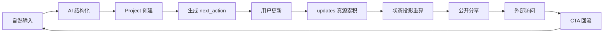

# OneFile 产品系统文档（SaaS 升级版）

版本：v1.0  
日期：2026-03-27  
适用阶段：Demo → 初级 SaaS 原型 → 可持续演化产品系统

---

## 1. Product Brief（产品定义）

OneFile 是一个 AI 原生的项目结构化与演化系统。它的核心不是“记录”，而是把非结构化输入（文本、聊天记录、BP、文件）持续转化为可表达、可演化、可分享的项目资产（Project）。

### 1.1 产品使命

帮助个体与小团队把模糊想法变成可持续推进的项目资产，并通过持续更新形成真实成长轨迹。

### 1.2 核心用户

- 早期创业者、独立开发者、产品经理、咨询/投研从业者
- 拥有大量碎片化输入，但缺乏结构化沉淀与迭代框架的人

### 1.3 核心价值

- 从“想法”到“结构化项目”：降低启动门槛
- 从“一次生成”到“持续演化”：形成复访理由
- 从“私有记录”到“可控分享”：形成外部反馈与增长闭环

### 1.4 非目标（当前阶段）

- 不做通用笔记/文档协作平台
- 不做复杂项目管理（甘特图、多人流程引擎）
- 不以视觉编辑能力作为当前竞争核心

---

## 2. Problem & Positioning（问题与定位）

### 2.1 用户问题

- 输入高度非结构化，难以形成一致项目描述
- 大多数工具只支持“记录”，不支持“演化”
- 内容会积累，但行动与决策不会累积
- 分享后无有效回流机制，难形成增长飞轮

### 2.2 市场空位

- 笔记工具擅长收集，不擅长项目状态推进
- 项目管理工具擅长执行，不擅长从模糊输入启动
- OneFile 位于两者之间：以 AI 驱动“从混沌到结构，从结构到演化”

### 2.3 产品定位

OneFile 是“项目资产演化系统”，不是“文本容器”。

定位语句：
> OneFile 帮你把任何输入变成一个会成长、可被验证、可被分享并可回流的 Project 资产。

---

## 3. Core Concept：Project as an Evolving Asset（核心概念）

### 3.1 Project 的定义

Project 是一个长期存在的资产对象，包含：

- 稳定身份：`id`、`owner_user_id`
- 当前投影：`latest_update`、`current_state`、`next_action`
- 演化真源：`updates[]`
- 外部传播状态：`share`

### 3.2 关键原则

- `updates[]` 是唯一真实历史（Source of Truth）
- `latest_update` 只是一种“当前视图投影”（Projection）
- 每次更新都应改变系统理解，而不是仅追加文本
- Project 价值随“更新质量与决策质量”共同提升

### 3.3 资产化判断标准

一个 Project 被视为“资产化”而非“记录化”，需满足：

- 有连续更新轨迹（时间与语义连续）
- 有可执行的下一步行动（`next_action`）
- 有可验证的状态迁移（阶段、信号、结论变化）
- 有外部反馈或传播事件（分享、访问、回流）

---

## 4. User Flows（创建 / 更新 / 分享 / 回流闭环）

### 4.1 创建流（Create）

1. 用户输入自然语言（可附文件）
2. AI 执行结构化抽取与标准化
3. 系统生成首个 `Project` 与首条 `Update`
4. 产出首版 `next_action`，建立后续回访锚点

### 4.2 更新流（Update）

1. 用户补充进展、数据、决策或问题
2. 系统生成新 `Update` 并解析信号（完成度、证据强度、行动对齐）
3. 重算项目投影：`latest_update`、`current_state`、`progress_eval`、`next_action`
4. 如识别停滞或风险，触发干预建议（intervention）

### 4.3 分享流（Share）

1. 默认私有，用户主动切换公开
2. 公开页展示项目当前投影 + 演化摘要
3. 访客可查看，系统记录 `share_viewed`
4. 分享页附带回流 CTA（返回 OneFile 创建/更新自己的项目）

### 4.4 回流闭环（Return）

1. 用户因 `next_action` 或干预提醒回访
2. 完成更新后看到状态变化（成长反馈）
3. 成果可再次分享，带来新访问与新回流
4. 循环形成“使用频次 + 资产价值”双增长

### 4.5 端到端闭环图



---

## 5. Information Architecture（信息结构）

### 5.1 一级结构

- Auth Session（轻身份）
- Project List（可见项目集合）
- Project Detail（单项目资产页）
- Share Page（公开阅读页）

### 5.2 Project Detail 信息层

- 概览层：标题、阶段、状态标签、核心摘要
- 行动层：`current_tension`、`next_action`
- 演化层：`updates[]` 时间序列与关键版本足迹
- 运营层：`ops_signals`、`progress_eval`、`intervention`
- 分享层：`share.is_public`、`slug`、回流入口

### 5.3 IA 设计原则

- 单项目视角优先，避免分散信息到多个孤立页面
- 当前投影与历史真源并存，防止“只看当下”
- 所有关键状态必须可追溯到某次更新或事件

---

## 6. Data Model（User / Project / Update / Share）

### 6.1 User

核心字段：

- `id`
- `email`
- `created_at`
- `last_seen_at`
- `status`

语义：轻账号身份，用于项目归属与可见性控制。

### 6.2 Project

核心字段分层：

- 身份与归属：`id`、`owner_user_id`
- 结构化内容：`title`、`summary`、`problem_statement`、`solution_approach`、`stage`、`form_type`、`model_type`
- 演化真源：`updates[]`
- 当前投影：`latest_update`、`current_state`、`current_tension`、`next_action`
- 评估信号：`progress_eval`、`system_confidence`、`decision_quality_score`
- 运营信号：`ops_signals`
- 分享状态：`share`

### 6.3 Update

建议标准字段：

- `id`、`project_id`、`author_user_id`
- `content`、`created_at`
- `source`（user_input/system_migration/share_feedback 等）
- `kind`（result/decision/learning/risk/hypothesis）
- `evidence_score`
- `action_alignment`
- `completion_signal`
- `input_meta`

语义：Update 不是“备注”，而是“对项目状态有影响的演化事件”。

### 6.4 Share

核心字段：

- `is_public`
- `slug`
- `published_at`
- `last_shared_at`

补充建议字段（下一阶段）：

- `share_views_total`
- `share_cta_clicks_total`
- `share_conversion_total`

---

## 7. Evolution Logic（演化逻辑，updates 作为真源）

### 7.1 不变量（Invariants）

- 不允许无 `updates[]` 的已创建 Project
- `latest_update` 必须可由 `updates[0]` 或投影规则重建
- `next_action` 必须与最近更新语义相关
- 所有状态变化应可回溯到 Update 或 Event

### 7.2 投影引擎（Projection Engine）

每次新增 Update 后执行：

1. 解析语义信号（进展、风险、证据、行动完成）
2. 更新 `progress_eval`（状态/分数/原因）
3. 更新 `current_state` 与 `current_tension`
4. 生成或刷新 `next_action`
5. 评估是否触发 `intervention`

### 7.3 演化质量定义

- 更新频率：是否持续发生
- 更新质量：是否包含证据与明确结论
- 行动闭环：`next_action` 是否被执行并带来新信息
- 决策质量：是否减少不确定性并推进阶段目标

---

## 8. Share & Growth Loop（分享与增长闭环）

### 8.1 分享目标

- 让项目“可被看见”
- 让外部反馈进入项目演化链路
- 让分享成为回访触发器，而非一次性出口

### 8.2 闭环机制

1. 项目达到可展示状态后公开
2. 外部访问触发 `share_viewed`
3. 分享页 CTA 引导“创建自己的 OneFile 项目”或“回到原项目继续更新”
4. 回流后新 Update 产生，提升项目质量
5. 更高质量项目带来更高分享转化

### 8.3 增长核心指标

- 分享率：公开项目数 / 总项目数
- 访问率：有访问的公开项目 / 公开项目数
- 回流率：CTA 点击后产生登录或创建行为占比
- 分享后 7 日更新率：衡量分享是否驱动继续演化

---

## 9. AI Pipeline（输入 → 结构化输出）

### 9.1 输入层

- 文本输入（主路径）
- 文件输入（可选，先文本化再合并）
- 补充上下文（历史更新、当前阶段、最近行动）

### 9.2 处理层

1. 清洗与去噪（去模板污染、去无效标记）
2. 语义分段与槽位提取（问题、方案、用户、阶段等）
3. 类型标准化（`stage`、`form_type`、`model_type`）
4. 生成 Update 信号（evidence/action/completion）

### 9.3 输出层

- 创建场景：输出结构化 Project + 初始 Update
- 更新场景：输出新 Update + 投影重算结果
- 异常场景：降级为保守结构化并返回 warning

### 9.4 质量保障

- Schema 校验
- 脏数据拦截（markup 污染、异常字段）
- 关键字段兜底（标题、阶段、owner、share 默认值）

---

## 10. State Management（状态流）

### 10.1 状态分层

- 持久状态：`users/projects/events`（JSON）
- 会话状态：当前用户、选中项目
- 派生状态：`latest_update`、`progress_eval`、`ops_signals`、`intervention`

### 10.2 状态变化触发器

- 用户登录：用户补全 + 无主项目归属迁移
- 项目创建：首个 Update 写入 + 事件写入
- 项目更新：Update 写入 + 投影重算 + 干预判断
- 分享切换：可见性改变 + 分享事件/时间戳更新
- 分享访问：访问事件写入 + 回流行为跟踪

### 10.3 一致性策略

- 先写真源（Update/Event），后写投影
- 所有派生字段支持重建
- 失败时优先保证真源不丢失

---

## 11. Storage Design（数据结构与迁移）

### 11.1 当前存储

单文件 JSON：

```json
{
  "schema_version": 2,
  "users": [],
  "projects": [],
  "events": []
}
```

### 11.2 存储原则

- 向后兼容：新增字段必须有默认值
- 读时迁移：加载时清洗历史字段并补全缺失结构
- 写时规范化：统一写入标准 schema

### 11.3 迁移路线（建议）

1. v2（当前）：本地 JSON，单机原型
2. v3：抽象 Repository 层，JSON/DB 双实现
3. v4：迁移到托管数据库（Postgres），保留事件与更新索引
4. v5：引入审计日志、分享分析表、异步任务表

### 11.4 数据安全与可靠性

- 本地模式下增加定时备份（按天快照）
- 迁移到 DB 后启用事务与唯一约束
- 对 `owner_user_id + project_id` 建访问控制检查

---

## 12. Frontend Design Execution Spec（前端执行规范）

### 12.1 设计目标与原则

- 设计目标：对外分享与转化优先，30 秒内让陌生访客理解项目价值并触发主 CTA。
- 视觉原则：简洁、克制、可信，不做炫技视觉。
- 色彩原则：低色彩，全站仅使用中性色 + 1 个品牌强调色 + 1 个状态色。
- 交互原则：每屏只允许 1 个主 CTA，避免注意力竞争。
- 架构原则：前端负责流程与呈现，不承担业务真值计算（由后端投影引擎完成）。

### 12.2 Visual Tokens（必须统一）

- Typography
- Primary UI Font: `Inter`（或 `Plus Jakarta Sans`，二选一并全站统一）
- Mono Font: `JetBrains Mono`
- Color Tokens
- `--bg`: `#F7F8FA`
- `--surface`: `#FFFFFF`
- `--text-primary`: `#111827`
- `--text-secondary`: `#6B7280`
- `--border`: `#E5E7EB`
- `--accent`: `#2563EB`（唯一品牌强调色）
- `--success`: `#16A34A`（仅状态使用）
- Spacing & Shape
- 8pt 间距体系：`4/8/12/16/24/32/48`
- 统一圆角：卡片 `12px`，面板 `16px`，胶囊标签 `9999px`
- 阴影仅两档：`card` / `focus`

### 12.3 页面级信息层级（Share-First）

- 登录页（Landing + 邮箱）
- 左侧价值区：一句价值 + 一句可信背书（隐私与归因能力）
- 右侧登录卡：单输入（邮箱）+ 单主 CTA（进入项目空间）
- 输入非法时即时提示，不允许沉默失败
- 项目列表页
- 顶部：资产健康摘要（活跃、停滞、分享转化）
- 中部：项目卡片列表（状态与下一步优先）
- 底部/侧边：创建新项目入口
- 项目详情页
- 主区：`current_state`、`current_tension`、`next_action`
- 次区：`updates` 时间线（真源）
- 侧区：分享状态与增长信号（views/cta）
- 分享页（最高优先）
- 首屏：一句话价值 + 阶段信号 + 单一主 CTA
- 中段：近 3 条关键演化更新 + 当前 next_action
- 底段：简短社会证明 + 次级 CTA

### 12.4 组件与交互规范

- CTA 按钮
- 每个视口仅一个主按钮（实心 `--accent`）
- 次按钮仅描边或文本样式
- 文案必须动词开头：`进入项目空间`、`继续更新`、`创建我的项目档案`
- Update Timeline Item
- 必含：时间、`kind`、证据强度、行动对齐
- 默认展示 3 条，可展开更多
- 状态反馈
- `loading`: 骨架屏，不使用全屏阻塞
- `empty`: 给出直接主动作
- `error`: 字段侧错误 + 可重试，不仅 toast
- 动效约束
- 时长：`120ms / 200ms / 320ms`
- 仅用于状态切换与层级引导，不做装饰性动画

### 12.5 响应式与可访问性

- 断点：`360 / 768 / 1024 / 1440`
- 移动端优先级：`next_action > latest_update > timeline > secondary metrics`
- 移动端时间线默认折叠为最近 3 条
- 不允许横向滚动；触控目标最小 `44px`
- 颜色对比满足基础可读性（正文与背景保持高对比）

### 12.6 状态管理与 API 对齐

- 远端状态：按 `project_id` 粒度缓存与刷新
- 本地瞬时状态：输入草稿、上传队列、提交状态
- 错误通道：结构化错误码映射（`invalid_email`/`invalid_title`/`forbidden`）
- 分享闭环接口必须接通：
- `GET /v1/share/{id}`
- `POST /v1/share/{id}/cta`
- 关键链路：创建 -> 更新 -> 分享 -> CTA 回流

### 12.7 设计验收清单（DoD）

- 分享页首屏 5 秒内可理解“项目价值 + 主动作”
- 每屏仅 1 个主 CTA，且具备埋点可追踪
- 关键流程可用：创建/更新/分享/回流
- 三态完整：`empty/loading/error`
- 视觉 token 使用一致，不出现随意硬编码色值
- 移动端与桌面端均可正常使用

### 12.8 Streamlit Frontend 落地映射（当前实现）

- 主前端入口：`app.py + ui_components.py`（线上 Streamlit 部署生效路径）
- 登录页落地
- `app.py` 未登录分支采用左右双区：价值面板 + 登录卡
- 仅保留 1 个主 CTA（`进入项目空间`），邮箱实时校验并显示字段级提示
- Share 页主 CTA 规则
- 公开可访问：访客主 CTA 为「创建我的项目档案」；Owner 主 CTA 为「继续更新这个项目」
- 私有不可访问：仅保留一个主 CTA「创建我的项目档案」
- 列表/详情主 CTA 规则
- 列表卡片主 CTA 固定为「查看完整档案」
- 详情页主 CTA：Owner 为「编辑项目」，访客为「创建我的项目档案」
- 回流链路行为
- Share 页点击主 CTA 时签发 `cta_token` 并记录 `share_cta_clicked`
- 回流创建/更新时自动做 `share_conversion_attributed`（按 `create/update` 分别归因，重复会被跳过）
- token 通过 URL 参数与会话态传递，确保登录前后都可继续归因
- 视觉 token（实现约束）
- `--bg #F7F8FA`、`--surface #FFFFFF`、`--text #111827`、`--muted #6B7280`、`--line #E5E7EB`
- 品牌强调色 `--accent #2563EB`；状态色 `--success #16A34A`
- 多状态色收敛：阶段差异优先使用明度/边框/字重，不新增多品牌色竞争

---

## 13. Backend Logic（状态变化逻辑）

### 13.1 核心能力域

- 身份与归属：用户创建/登录、项目 owner 校验
- 项目生命周期：创建、编辑、更新、删除
- 演化引擎：更新信号解析、投影刷新、干预触发
- 分享域：公开控制、公开访问、回流事件记录

### 13.2 命令与查询分离（建议）

- Command：`create_project`、`update_project_progress`、`toggle_share` 等
- Query：`get_visible_projects`、`get_project_detail`、`get_share`

收益：

- 降低副作用耦合
- 便于后续做异步化和可观测性

### 13.3 关键校验

- email 合法性与标准化
- owner 权限校验
- Project 输入长度与文本清洗
- Update 信号范围约束（0~1）

---

## 14. Local Development Guide

### 14.1 环境准备

```bash
cd /Users/joesun/Desktop/OneFile
python -m venv .venv
source .venv/bin/activate
pip install -r requirements.txt
```

### 14.2 启动后端（FastAPI）

```bash
uvicorn backend.main:app --host 127.0.0.1 --port 8000 --reload
```

- Health: `http://127.0.0.1:8000/health`
- API Base: `http://127.0.0.1:8000/v1`

### 14.3 启动前端（Next.js）

```bash
cd frontend
npm install
BACKEND_API_URL=http://127.0.0.1:8000 npm run dev
```

- Web: `http://localhost:3000`
- Share: `http://localhost:3000/share/<project_id>`

### 14.4 启动 Streamlit（可选）

```bash
streamlit run app.py
```

### 14.5 本地数据说明

- 数据文件：`data/projects.json`
- 建议在调试前复制一份快照，避免样例污染

---

## 15. Deployment Model（简化版）

### 15.1 当前推荐形态

- 前端：Vercel（Next.js）
- 后端：轻量 Python 容器（FastAPI）
- 存储：当前可保留 JSON（仅原型），生产建议切 DB

### 15.2 最小可用部署路径

1. 部署后端并暴露 `/v1`
2. 部署前端并配置 `BACKEND_API_URL`
3. 验证登录、创建、更新、分享、分享页访问
4. 配置基础监控（健康检查 + 错误日志）

### 15.3 生产化红线

满足以下条件前，不建议长期生产使用 JSON 文件存储：

- 日活 > 20
- 并发写入频繁
- 需要可靠审计与恢复

---

## 16. Roadmap（下一阶段能力）

### Phase A：SaaS 基础可靠性（1~2 周）

- 引入 Repository 抽象层
- 完成 DB 迁移方案设计（含回滚）
- 补齐关键事件埋点（share/cta/update completion）

### Phase B：演化体验增强（2~4 周）

- Update 类型可视化（结果/学习/风险/决策）
- 演化时间线与阶段迁移解释
- next_action 完成反馈与质量评分提升

### Phase C：增长闭环强化（2~4 周）

- 分享页增长组件（模板化 CTA、示例项目）
- 分享来源追踪（source/ref）
- 分享转化仪表盘（view → click → create/update）

### Phase D：多项目运营与智能助理（4+ 周）

- 项目组合视图（Portfolio）
- 周报自动生成（基于 updates）
- 干预策略学习（哪类提醒最有效）

---

## 17. Known Risks & Open Questions

### 17.1 已知风险

- JSON 存储在并发与持久性上存在天然上限
- 轻身份（邮箱 + session）在安全与跨设备体验上有限
- 过度依赖 AI 自动结构化可能引入误判，需要可纠偏机制
- `latest_update` 与真实演化认知可能出现偏差，需增强可解释性

### 17.2 开放问题

- 回访的主触发器优先级：行动提醒、阶段变化、还是分享反馈？
- Update 最小有效粒度应如何定义，才能兼顾低门槛与高信息密度？
- 分享页应该展示多少历史细节，既体现成长又保护隐私？
- 何时从“单用户资产演化”扩展到“轻协作”？
- 增长优先做“公开发现”还是“私域分享回流”？

### 17.3 决策建议（当前阶段）

- 优先保证演化闭环可用性，再扩展获客能力
- 优先建设可观测性（events + conversion），再做增长优化
- 优先提升更新质量反馈，再做复杂协作功能

---

## 附录：系统一句话定义

OneFile 是一个把非结构化输入持续转化为“可演化项目资产”的 AI SaaS 系统，其核心竞争力是基于 `updates` 真源驱动的成长闭环，而不是一次性内容生成。
